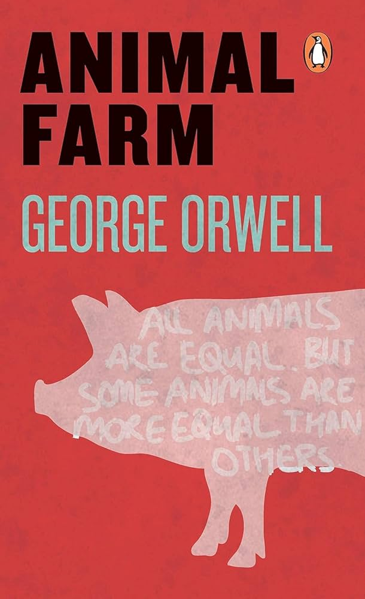

# March Dispatch - Whose Time is actually important?

I am writing this in the train from Bengaluru to Chennai, which was supposed to leave at 1:30PM but hasn't left at 2:30 yet. This disappoints me because I was on the other side of the equation just a few days ago, and the train didn't wait for me. I know it sounds absurd, but fury supersedes logic in such cases. The argument given here is that why would five hundred people (or whatever the number is) wait for one individual? But when the train gets delayed, it's the five hundred people who are waiting. It's true that there might be a legitimate reason behind the delay of a train, but so is true for the individual. A different analogy may help: if a student gets late for the class (for whatever reasons), the teacher will be furious and may not let him enter the classroom; but the students can't replicate the punishment for the teacher in case he gets late. Why is that?

## Why did you steal my heart ❤️?

The heart has been used as a symbol of love for hundreds of years; early philosophers have even put the centre of consciousness there. But why heart? One way to explain is from the observation that when a person dies, their heart stops beating. From that, it might be inferred that the heart is essential for the working of a human. 

The reason that heart is used as a symbol of love is quite simple. When we see our loved one, we can’t see the activities in different brain parts, we can't see the hormones being secreted in our blood, but we can feel our heartbeat rising. It's only the next time to think that heart is where the love takes place. And that's why we send ❤️ to our loved one and not 🧠. 

Sources: https://youtu.be/5-R_2VKnvzk

## From Shyam's Shelf 📚

The book for this week is going to be Animal Farm by George Orwell. Because I just love that book. It gives us the handbook of a dictator and gives us a lot to think about. It's one of those books which everyone should read. 

With that, I conclude this issue of my newsletter. I am new to this form of communication and I am still not sure how to do it properly. But I will get the hang of it quite soon, and with your help and feedback, I can do it quicker. So do write me back with feedback, did you like this issue? What was good, what can be improved, or just a chit chat. I would love that more than anything else. My email is: [shyam10kwd@gmail.com](shyam10kwd@gmail.com)

